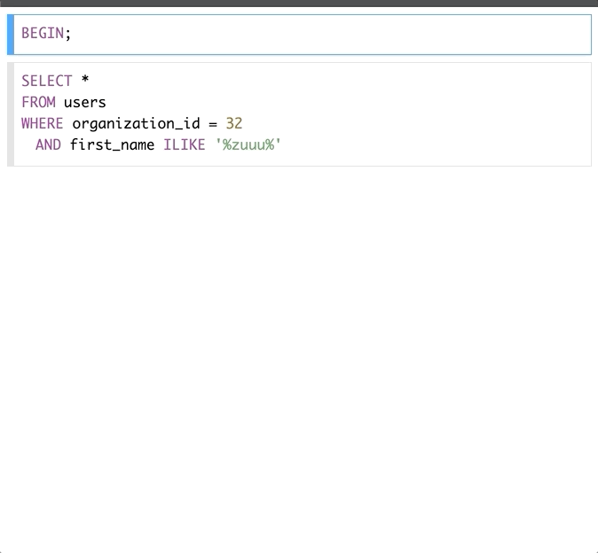

# experiments/react-query-runner

Experiment recreating the SQLBoss query statement editor with the following
goals/technologies:

- Minimal dependencies (no npm, no JSX)
- React
- React Hooks
- Mousetrap for keybindings
- Browser modules
- Docker
- node [http-server](https://www.npmjs.com/package/http-server)

## Running

Attaches to the [buoy](https://github.com/lightster/buoy) network as
`exp-react-query-runner`.

```
# Serve the public/ via http-server
docker-compose up
```

## Example


